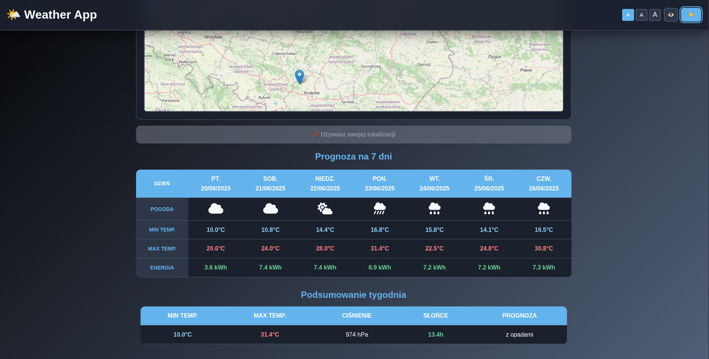
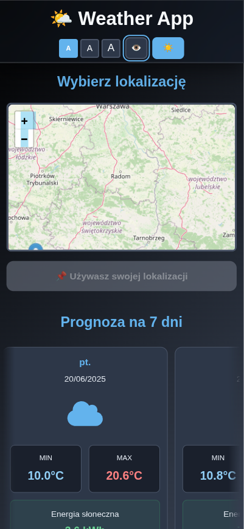
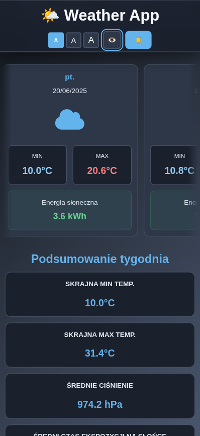

# 🌤️ Frontend Weather App  

### Kliknij aby wypróbować aplikacje ➡️ [🌐](https://frontend-weather-app.onrender.com/)

### Frontend Weather App to:
- Responsywna aplikacja pogodowa z zaawansowanymi funkcjami dostępności i interaktywną mapą do wyboru lokalizacji.

# Przykład motywu ciemnego
- Desktop

- Mobile

| Zdjęcie 1 | Zdjęcie 2 |
|-----------|-----------|
|  |  |

### 🌍 Lokalizacja
- Automatyczne wykrywanie lokalizacji przy starcie aplikacji
- Interaktywna mapa (Leaflet) do wyboru dowolnej lokalizacji na świecie
- Manual location picker - kliknij na mapie aby wybrać współrzędne

### 🌤️ Prognoza pogody
- 7-dniowa prognoza z szczegółowymi danymi
- Ikony pogody (FontAwesome) dopasowane do kodów pogodowych
- Temperatury min/max dla każdego dnia
- Szacowana energia słoneczna w kWh (dla paneli fotowoltaicznych)

### 📊 Podsumowanie tygodnia
- Skrajne temperatury (min/max z całego tygodnia)
- Średnie ciśnienie atmosferyczne
- Średni czas ekspozycji na słońce
- Komentarz podsumowujący prognozę

### ⚙️ Zaawansowana dostępność
- 3 dostępne motywy (jasny, ciemny, wysokiego kontrastu)
- Skalowanie czcionki (100% - 150%)
- Accessible fonts (OpenDyslexic dla dysleksji)
- ARIA labels
- Screen reader support

### 📱 Responsive Design
- Mobile-first approach
- Horizontal scroll cards na urządzeniach mobilnych
- Tabela na desktop